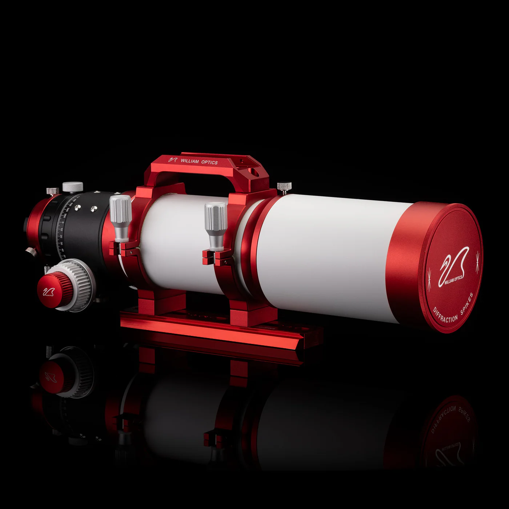
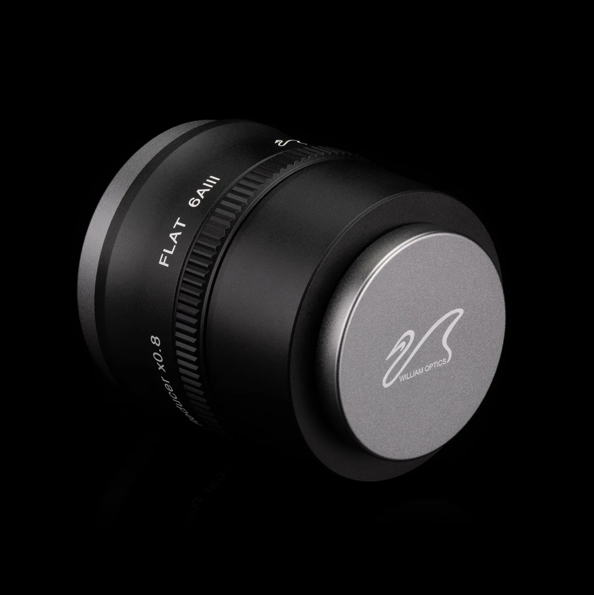

# William Optics GT81

## Backfocus configuration

| **Component**         | **Measurement**  |
|-----------------------|------------------|
| ZWO ASI53MC PRO       | 6.5mm            |
| T2/M42 spacer         | 11mm             |
| SV226 Filter Drawer   | 21mm             |
| M48-T2/M42 spacer     | 16.5mm           |
| 6AIII                 | 7.1mm            |
| **Total Backfocus**   | **62.1mm**       |

| **Specifications**     |                                 |
| ---------------------- | ------------------------------- |
| **Lens Type**          | Triplet Apochromatic Prime Lens |
| **Focal Length**       | 478 mm                          |
| **Diameter**           | 81 mm                           |
| **Aperture**           | f/5.9                           |
| **Image circle**       | 45 mm                           |
| **Focuser**            | 2.5" R&P Focuser                |
| **Optional Flattener** | FLAT 6AIII 0.8x                 |
| **Adapter Included**   | N/A                             |
| **Lens Material**      | FPL-53                          |
| **Camera Format**      | APS-C Full Frame                |
| **Tube Length**        | 390 mm - 460 mm                 |
| **OTA Weight**         | 3.9 kg / 8.6 lbs                |
| **Total Weight**       | N/A                             |

## 6AIII 0.8 Flatener

| **Specifications**        |                                                              |
| ------------------------- | ------------------------------------------------------------ |
| **Lens Type**             | 3 Groups 3 Elements                                          |
| **Total Length**          | 61.5 mm                                                      |
| **Telescope Thread**      | M63 x 1 x 6 mm                                               |
| **Camera Thread**         | M48 x 0.75 x 4 mm                                            |
| **T-mounts Supported**    | Canon EF, RF, Nikon F, Z, Sony E, Pentax K, MFT (M4/3), FUJI X|
| **Camera Format**         | > Full Frame                                                 |
| **Weight**                | N/A                                                          |

### Backfocus specifications

| **GRAN TURISMO 71** |         |
| ------------------- | ------- |
| Adjustment Distance | 9.1mm   |
| Back Focus          | 64.1mm  |
| Image Circle        | ∅44.4mm |

| **GRAN TURISMO 81** |         |
| ------------------- | ------- |
| Adjustment Distance | 7.1mm   |
| Back Focus          | 62.1mm  |
| Image Circle        | ∅44.4mm |

| **ZENITHSTAR 81**   |         |
| ------------------- | ------- |
| Adjustment Distance | 5.2mm   |
| Back Focus          | 60.2mm  |
| Image Circle        | ∅44.3mm |

| **ZENITHSTAR 103**  |         |
| ------------------- | ------- |
| Adjustment Distance | 2.5mm   |
| Back Focus          | 57.5mm  |
| Image Circle        | ∅43.1mm |

| **FLUOROSTAR 91**   | (requires additional adapter) |
| ------------------- | ----------------------------- |
| Adjustment Distance | 5.4mm                         |
| Back Focus          | 60.4mm                        |
| Image Circle        | ∅44.4mm                       |

# Camera

[ZWO ASI533MC-PRO](asi533mc-pro.md)